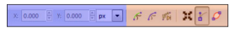

### Zadanie 1

Jak zmodyfikować opcję zarysu ścieżki?
Opisz i omów dostępne własciwości. 

### Zadanie 2

Przygotuj ścieżkę:

 - samochód
 - rower
 - rower z rowerzystą

### Zadanie 3

Przygotuj animację:
 - logo androida
 - biegnace zwierze

http://www.instructables.com/id/How-to-create-gif-animations/

### Zadanie 4

Przygotuj efekt na stronie WWW
http://svg.dabbles.info/snaptut-load-animate
http://tutorials.jenkov.com/svg/svg-animation.htmlhttp://tutorials.jenkov.com/svg/svg-animation.html
### Operacje na ścieżkach 

Gdy obiekt jest zaznaczony (i aktywne jest narzędzie __Edycja węzłów__), informacje o typie węzła nad którym znajduje się kursor myszy, są wyświetlane na listwie statusu.

Interpretacją graficzną węzła ścieżki jest charakterystyczny aznacznik: o kształcie rąbu - węzeł ostry, okrąg - automatycznie wygładzony, pozostałe - kwadrat. 

Typy węzłów:
 - ostry
 - gładki
 - symetryczny
 - automatycznie wygładzany

#### Węzeł ostry

Wykorzystywany do łączenia prostych odcinków oraz krzywych Beziera. 
Zależnie od sytuacji charakteryzuje się jednym uchwytem sterującym, dwoma lub ich brakiem. 
Pozycja wszystkich uchwytów może być dowolnie zmieniona. 

#### Węzeł gładki

Uchwyty rozmieszczone są współliniowo. 
Odległość uchwytów od węzła może być zmieniana niezależnie.

#### Węzeł symetryczny

Węzeł wygładzony, jednak odlegność uchwytów od węzła zmienia się symetrycznie. 
Od tego wzięła się jego nazwa. Gdy zmieniamy położenie jednego uchwytu, wowczas położenie drugiego jest zmieniane automatycznie

#### Węzeł automatycznie wygładzany

Jest to również węzeł wygładzony, w którym położenie uchwytóœ jest kontrolowane przez program. Każda zmiana położenia węzła lub węzłów z nim sąsiadujących spowoduje dopasowanie paramet©ów tak, aby zachować gładkość ścieżki. 

### Ścieżki pojedyncze i subścieżki

Wszystkie narzędzia rysujące dostępne w Inkscape tworzą ścieżki __pojedyncze__ ___(ścieżki proste)___.

Prócz ścieżek prostych często mamy do czynienia ze ścieżkami złożonymi. 

Z punktu widzenia języka SVG jest to najzwyklejsza ścieżka, w której punkt rysowania kolejnego fragmentu nie rozpoczyna się w punkcie końcowym fragmentu poprzedniego. Zamiast tego następuje "przesunięcie" punktu i rozpoczęcie rysowania w innym miejscu. Dzięki temu powstają dwa (lub więcej) niepolączone ze sobą fragmenty jednego obiektu, nazywane __subścieżkami__ lub __ścieżkami podrzędnymi__. 

Dostępnymi narzędziami rysującymi nie utworzymy ścieżek złożonych. Jest to możliwe sa pomocą:
 - operacja __Połącz__
 - rozłączenie węzłów

### Listwa kontroli narzędzia __Edycja węzłów__

 - Wyświetlenie węzłów ścieżki przycięcia
 - Wyświetlenie węzłów maski
 - Live Path Effects
 - Jeśli zaznaczymi klika węzłów, możemy je przekształcić jak zwykłe obiekty.
 - Jeśli uchwyty węzłów są widoczne, zostaną wyświetlone
 - Podświetlenie zaznaczonej ścieżki (zarys - bez efektów)

Właściwości zarysu możemy kontrolować, zmieniając ustawienia w preferencjach programu. 

### Zaznaczanie węzłów czy obiektów?

Zaznaczanie obiektów - zaznacz aobiekty, pokazuje węzły, ale żadnego nie zaznacza.
Druga operacja zaznacza węzły ścieżki, co możliwe jest dopiero po zaznaczeniu obiektu.

Krok1: Uruchomienie narzędzia ___F2___
Krok2: Klik na obiekt. Spowoduje to wyświetlenie jego obwiedni i pokazaniu wszystrkich węzłów
Krok3: Z klawiszem shift zaznaczamy kolejne węzły
Krok4: Wciśnięcie klawisza myszy w obszarze półtna spowoduje rysowanie ramki zaznaczenia. Wszystkie obiekty znajdujące się w obszarze ramki zostaną zaznaczone po puszczeniu klawisza myszy. 

Zaznaczenie odbywa się za pomocą:

- kliknięcie węzła
- kliknięcie ścieżki, zaznaczenie krańcowych węzłów klikniętego odcinka ścieżki
- "rysowanie" zaznaczenia
- scrollem

Przy użyciu klawiatury:
 - ___Tab___ pierwszy węzeł w aktywnym obiekcie
 - ___Shift+Tab___ -  poprzedni węzeł/ostatni
 - ___Ctrl+a___ - wszystkie węzły
 - ! - jesli przynajmniej jeden jest zaznaczony, odwraca kolejność zaznaczenia. Działa w obrębie subścieżki
 - ___Alt+!___ - j/w ale w obrębie całej ścieżki

### Dodawanie węzłów

Ścieżka nie musi składać się ze stąłej liczby węzłów. Inkscape podczas dodawania węzła próbuje zachować kształt ścieżki, modyfikując uchwyty węzłów. 

Aby dodać węzeł:
 - 2x klik
 - ctrl+alt + 1 klik

W obu przypadkach dodawany jest węzeł __gładki__

Zaznaczony węzeł najprościej jest usunąć wciskając __Delete__ lub __Backspace__. Jeśl użyjemy tych klawiszy z wciśniętym __Ctrl__, zaznaczone węzły zostaną usunięte, a położenie uchwytów wszystkich pozostałych węzłów nie zmieni się. W przeciwnym razie Inkscape będzie starał się zachowac poprzedni kształt ściezki. 

### Przesuwanie 

- zaznaczony węzeł może zostać złapany i przesunięty kursorem myszy
- złapanie za ścieżkę i przesunięcie kursora spowoduje deformację złapanego odcinka pomiędzy najbliższymi węzłami
- ctrl - w pionie lub poziomie
- alt + ctrl - przesunięty po liniii prostej, której kierunek określa aktualne nachylenie ścieżki
- shift - podczas przesunięcia - wyłączenie tymczasowo przyciągania do elementów na płótnie (obiektów, prowadnic, siatek, ...)

Jesli operacja przesuwania jest wykonywana z klawiszem alt,to zmiana pozycji wezlow bedzie nastepowac zgodnie z algorytmem,w którym przesuniecie jest nakwieksze dla złapanego węzła i najmniejsza wraz ze zwiekszeniem odległosci.

#### Automatyczne rozmieszczenie 

Ręczna zmiana pozycji węzłów jest cześto wykorzystywana, ale nadaje sie do edytowania niewielkiej ilosci wezłow. Aby pomóc zarządzanie wieloma węzłami należy wybrać okno : __Obiekt/Wyrównaj i rozmieść__ lub ___Shift+Ctrl+A___. Przed użyciem narzędzia musimy zaznaczyć węzły.

- rozmieszczenie w linii poziomej (srednia wartosc polozenia osi y)
- pionowej
- rozmieszczenie x
- rozmieszczenie y

### Operacje na ścieżkach

- Suma - ctrl++
- Różnica - Ctrl+-
- Cześć wspolna - Ctrl+*
- Wykluczenie - Ctrl+^. Na podstawie co namniej dwóch ścieżek. Obiekt tworzony w postaci połączonych subścieżek. Nowa subścieżka wypełniona jest zgodnie z regułą nieparzystości.
- Podział - z 2 scieżek są tworzone co najmniej dwie. Sciezka dolna jest dzielona przez wspolny obszar obu sciezek.
- Rozcięcie - 2 sciezki nieposiadajace wypeknienia (z samym konturem). krawedz dolnej sciezki jest dzielona przez wspolna krawedz obu sciezek
- Połącz - Ctrl+K Sciezka/Polacz tworzy nowa sciezke zlozona z subsciezek, ktra zawiera wszsytkie wezly sciezek wyjsciowych. Operacje te mozna wykonac na wszystkich obiektach (poza grafika bitmapowa). Kolor jest taki, jak obiektu polozonego najwyzej na stosie
